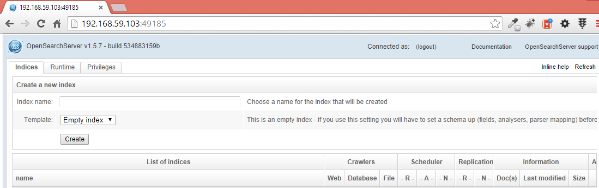
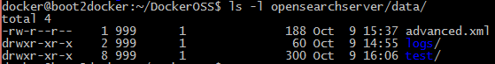
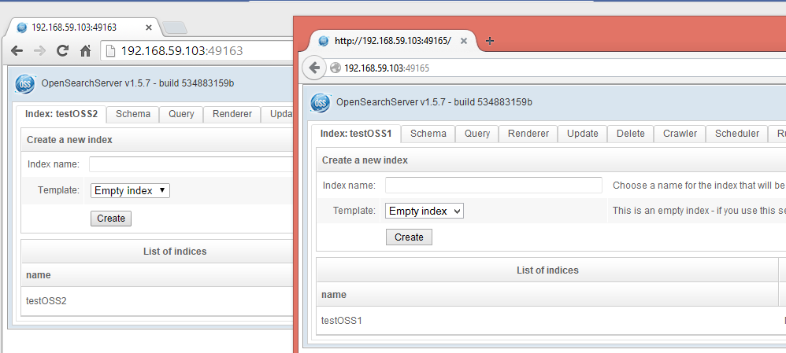

# Work in progress

## Docker's image for OpenSearchServer

This image will allow for the quick, easy and unlimited parallel creation of systems hosting OpenSearchServer. 

## Usage

### Run a container

`/path/to/local/folder` must be a directory that must contains directories `opensearchserver/data`. **It will be used as the data folder by OpenSearchServer**.

    docker run -d -P -v </path/to/local/folder>:/srv alexandretoyer/opensearchserver

* parameter `-d` tells docker to daemonize this container (run in background)
* parameter `-P` tells docker to map ports exposed in the container
* parameter `-v` is used to map a local folder to the `/srv` folder inside the container

#### Configure memory

Variable `MEMORY` can be used to configure memory to allow to OpenSearchServer.

Value can be expressed with unit `k`, `m` or `g`.

    docker run -d -P -v </path/to/local/folder>:/srv -e MEMORY=4g alexandretoyer/opensearchserver

### Get port used by Docker

    docker ps -l

Here is an output example:

    CONTAINER ID        IMAGE                                    COMMAND                CREATED             STATUS              PORTS                     NAMES
    3b49cb1c7fed        alexandretoyer/opensearchserver:latest   /bin/sh -c '/start_o   23 minutes ago      Up 23 minutes       0.0.0.0:49185->9090/tcp   backstabbing_mayer

Column `PORTS` gives us the port to use. In this example it's `49185`.

### Open browser to access OpenSearchServer

Browse to `127.0.0.1:<port used by docker>`, for example `127.0.0.1:49185`.

OpenSearchServer now runs in a Docker container:

Data folder is stored on host system. For instance after having created an index named `test`:

#### When using boot2docker

First use command `boot2docker ip` to get IP used by boot2docker. Then use this IP and the port used by Docker to access OpenSearchServer, for example `192.168.59.103:49185`.

## Create several containers
It's now possible to create several containers:

    mkdir -p OSS1/opensearchserver/data
    mkdir -p OSS2/opensearchserver/data
    docker run -d -P -v ~/DockerOSS/OSS1:/srv -e MEMORY=3g alexandretoyer/opensearchserver
    docker run -d -P -v ~/DockerOSS/OSS2:/srv -e MEMORY=1856m alexandretoyer/opensearchserver

Here running `docker ps` will give:

    CONTAINER ID        IMAGE                                    COMMAND                CREATED             STATUS              PORTS                     NAMES
    2f95109b18c8        alexandretoyer/opensearchserver:latest   /bin/sh -c '/start_o   3 minutes ago       Up 3 minutes        0.0.0.0:49165->9090/tcp   backstabbing_morse
    b98be11e2d33        alexandretoyer/opensearchserver:latest   /bin/sh -c '/start_o   5 minutes ago       Up 5 minutes        0.0.0.0:49163->9090/tcp   trusting_kowalevski

Instances can be accessed by two browsers, and different index can be created:

Index are created in two different folders:

    docker@boot2docker:~$ ls -l DockerOSS/OSS1/opensearchserver/data/
    total 4
    -rw-r--r--    1 999      1              188 Oct 10 08:11 advanced.xml
    drwxr-xr-x    2 999      1               60 Oct 10 08:04 logs/
    drwxr-xr-x    7 999      1              200 Oct 10 08:12 testOSS1/
    docker@boot2docker:~$ ls -l DockerOSS/OSS2/opensearchserver/data/
    total 4
    -rw-r--r--    1 999      1              188 Oct 10 08:10 advanced.xml
    drwxr-xr-x    2 999      1               60 Oct 10 08:09 logs/
    drwxr-xr-x    7 999      1              200 Oct 10 08:12 testOSS2/
    docker@boot2docker:~$

---

## Build images
### Clone repo

    git clone https://github.com/AlexandreToyer/opensearchserver-docker.git

### Build images

#### Image for Debian + OpenJDK

    docker build -t="alexandretoyer/debian-openjdk7jdk" ./debian-openjdk7jdk/

#### Image for OpenSearchServer

Current Dockerfile will download and use **`opensearchserver-1.5.7-b767.deb`**.

    docker build -t="alexandretoyer/opensearchserver" ./opensearchserver/
